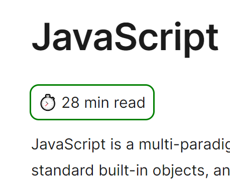

# Welcome to this Chrome extension!

This Chrome extension is designed to address user retention challenges and demonstrate features that help enhance user experience and tailor the extension's functionality to the specific needs of a user.

## Overview

**Word Count and Reading Time Estimation:** This extension comes into action when the user is browsing technical documentation on MDN reference pages. It calculates the word count on a page and adds a snippet with an estimation of the reading time.

## Features

### Assisting customer retention

- **[Onboarding page](https://developer.chrome.com/docs/extensions/reference/api/tabs#open_an_extension_page_in_a_new_tab):** A dedicated page to welcome new users, explain the extension's functionality, and set expectations to ensure a smooth onboarding experience.

- **[Exit page](https://developer.chrome.com/docs/extensions/reference/api/runtime#example-uninstall-url):** Upon uninstallation, users are directed to a survey page to gather feedback and insights for future iterations. Additionally, this page can be used to make an offer to retain users who are leaving due to affordability issues.

- **[Options page](https://developer.chrome.com/docs/extensions/develop/ui/options-page):** Allows users to customize the extension according to their needs, such as disabling it on specific websites or contacting the developer with questions or bug reports.

### User Interaction

- **[Tooltip](https://developer.chrome.com/docs/extensions/develop/ui#tooltips):** Provides information about the extension when users hover over the extension icon, improving user understanding.

- **[Popup](https://developer.chrome.com/docs/extensions/develop/ui/add-popup):** Displays important information and settings when users click the extension icon in the browser, offering convenient access to key features.

- **[Badge](https://developer.chrome.com/docs/extensions/develop/ui#badges):** Displays a badge over the extension icon to indicate its current state, such as "On" or "Off".

### Enhanced Security

- **[Optional permissions](https://developer.chrome.com/docs/extensions/reference/api/permissions#implement_optional_permissions):** Ensure transparency and security by explaining why specific permissions are required. Users can enable permissions as needed.

## Installation

To install the extension, simply clone this repo. Then follow these steps:

- 1. Go to the Extensions page by entering chrome://extensions in a new tab.
- 2. Enable Developer Mode by clicking the toggle switch on the right.
- 3. Click the **Load unpacked** button on the left and select the extension directory

If needed, please refer to [Chrome Extension Docs](https://developer.chrome.com/docs/extensions/get-started/tutorial/hello-world#load-unpacked) for further instructions on installation.

## Conclusion

If you have any questions or suggestions, don't hesitate to reach out to the author.

Thank you for using this Chrome extension!
